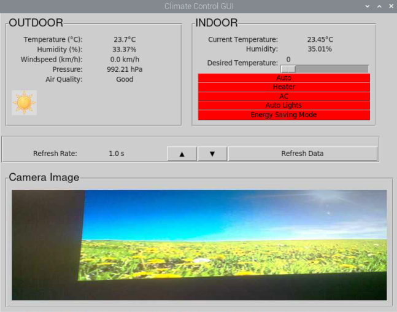

# Weather Station/Smart Home Project

The project utilizes a Raspberry Pi along with some simple sensors to develop a weather station/smart home device. The features of this project provide the user with outdoor weather conditions and indoor temperature conditions on a graphical user interface. Additionally the interface allows the user to control indoor heating, cooling and lighting. The heating, cooling and lighting controls would need to be integrated with physical control devices in the home this device is being implemented in. The major emphasis is on gathering/analyzing data and control algorithms of indoor conditions.

## Features

1. Data Collection and Logging of the following information:
    - Temperature: Indoor and outdoor
    - Humidity: Indoor and outdoor
    - Pressure: Outdoor
    - Air Quality: Outdoor
    - Wind speed: Outdoor
    - Image: Outdoor
2. Sky Condition Analysis:
Using image processing and a CNN model, analyze sky photos to detect clear, overcast, or wet conditions, as well as day or night.
3. Lighting and Temperature Control:
Using LEDs, simulate dynamic lighting and temperature control depending on user input and sensor data.
4. Graphical User Interface (GUI):
A user-friendly GUI allows the user to access real-time weather data, and control indoor heating, cooling, and lighting
5. Energy-Saving Mode:
Reduce energy usage and enhance environmental sustainability.

## Usage

1. Clone the repository to your RaspberryPi.
    In bash
    git clone [git@github.ubc.ca/MECH-524-101-2023W1/weather_station_project.git](https://github.ubc.ca/MECH-524-101-2023W1/weather_station_project).
2. Set up the required hardware components as specified in the hardware documentaion.
3. Update your RaspberryPi over an internet connection using the following codes:

   ```bash
         sudo apt-get update
         sudo apt-get upgrade
   ```

4. Install and import the necessary external libraries and imports as specified in dependencies.
    In case the dependencies fail to install, create a virtual environment using the terminal and install the dependencies with the virtual environment active.
    Create a virtual environment using this code in the terminal:

   ```bash
         python3 -m venv *your_environement_name*
   ```

    Activate the environment using this code in the terminal:

    ```bash
         source *your_environment_name*/bin/activate*
    ```
    
      - Virtual Environment:
      A self-contained Python environment that allows you to manage project-specific dependencies and isolate them from the system-wide Python installation. This helps ensure that your project's dependencies do not interfere with other projects or the system, providing a clean and controlled environment for your application

5. Run the weather_station_main.py script using RaspberryPi IDE or weather_station_main on the RaspberryPi to start the weather station.
6. The GUI is shown below. The indoor environment controls are in the "Indoor" section, the buttons should go from red to green when a function is actiavted. The refresh rate can be adjusted with the up and down arrows beside the refresh rate.

   

## Hardware

- Raspberry Pi 4B
- BME280 Sensor
- Adafruit MiCS5524 air quality sensor
- MCP3008 A2D convertor
- Magnetic reed switch and magnet
- 3D printed anemometer
- Raspberry Pi camera
- LED lights
- Jumper cables
- 200 ohm resistors
- Breadboard

### Sensor to Raspberry Pi connections

- BME280 connected to I2C
- AdaFruit MiCs5524 and MCP3008 A2D connected to SPI
- Anemometer reed switch connected to pin 17
- Heating LED GPIO pin 15
- Cooling LED GPIO pin 14
- Lighting LED GPIO pin 18
- Camera connected to CSI port

## Dependencies

### External Libraries

In order to install external libraries, activate your virtual environment and enter the codes for the libraries listed below:

1. GPIO: Library for General Purpose Input/Output

   ```bash
   sudo apt-get install python3-rpi.gpio
   ```

2. smbus2: Library for interfacing with sensors

   ```bash
   pip3 install smbus2
   ```

3. BME280: Library for using BME280 sensor

   ``` bash
   pip3 install RPi.bme280
   ```

4. Pillow: Image processing library

   ```bash
   pip3 install Pillow
   ```

5. OpenCV (cv2): Library of functions aimed at real-time

   ```bash
   pip3 install opencv-python-headless
   ```

6. Numpy: Library that adds support for multi-dimensional arrays, matrices and high-level mathematical functions

   ```bash
   pip3 install numpy
   ```

7. TensorFlow Lite (TFLite): Deep learning framework for on-device interface

   ```bash
   pip3 install tflite-runtime
   ```

### Imports

1. General imports

   ```python
   import time
   import math
   import numpy as np
   import threading
   import os
   ```

2. Sensor Imports

   Imports used in the specific files that impliment the following sensors

   ```python
   # Camera imports
   import subprocess
   import time
   import datetime
   import cv2
   import glob
   import RPi.GPIO as GPIO
   import tensorflow as tf
   from keras.preprocessing.image import ImageDataGenerator
   from keras.preprocessing import image
   import tflite_runtime.interpreter as tflite
   from PIL import Image
   ```

   ```python
   # Anemometer imports
   import RPi.GPIO as GPIO
   ```

   ```python
   # BME280 sensor imports
   import smbus2
   import bme280
   ```

   ``` python
   #Air Quality sensor imports
   from gpiozero import MCP3008
   ```

   ```python
   # Control simulation imports
   from gpiozero import LED
   ```

3. GUI imports

   ```python

   from tkinter import Tk, Label, Scale, HORIZONTAL, LabelFrame, Button, StringVar, IntVar, Canvas, Toplevel, LEFT
   from PIL import Image, ImageTk
   import random
   import os
   from camera_module_new import Camera, DayAndNightAnalyzer
   from cnn_model_for_pi import RaspiPredictor
   import glob
   ```

## Troubleshooting

If you encounter any issues during the installation or setup process, refer to the following troubleshooting tips:

- **Issue 1:** *Sensor not showing reading on GUI*
  - **Solutions:**  
  - Check wiring connections: Ensure that the sensors are properly connected to the Raspberry Pi. Verify that there are no loose connections or wiring issues.
  - Run individual sensor code: Execute the code for each sensor individually to confirm that the sensors are providing readings. This helps isolate whether the issue is with the sensors or the integration with the GUI.

- **Issue 2:** *GUI not launching or displaying errors*
  - **Solution:** *Detailed solution or workaround*
    - Check dependencies: Ensure that all required dependencies, including external libraries and Python packages, are installed correctly. Refer to the 'Dependencies' section  and make sure each library is up-to-date.
    - Review error messages: If there are error messages when launching the GUI, carefully review them for any specific issues. The error messages can provide valuable information about what went wrong.
    - Verify system resources: Check if the Raspberry Pi has sufficient resources (CPU, memory) to run the GUI. Inadequate resources can lead to GUI launch failures.

## License

This project is licensed under the UBC GitHub License.

## Acknowledgement

- This project utilizes open-source libraries and resources from the community.
- Information on raspberry pi programming and weather monitoring using raspberry pi was used from [raspberrypi.org](https://www.raspberrypi.org/).
- ChatGPT was used for providing coding help during the development process and assisting with debugging

## Authors

1. Parmeet Brar:        Student ID: 20877288
2. Priyanshu Bhateja:   Student ID: 81567786
3. Halvard Ng:          Student ID: 41277492
